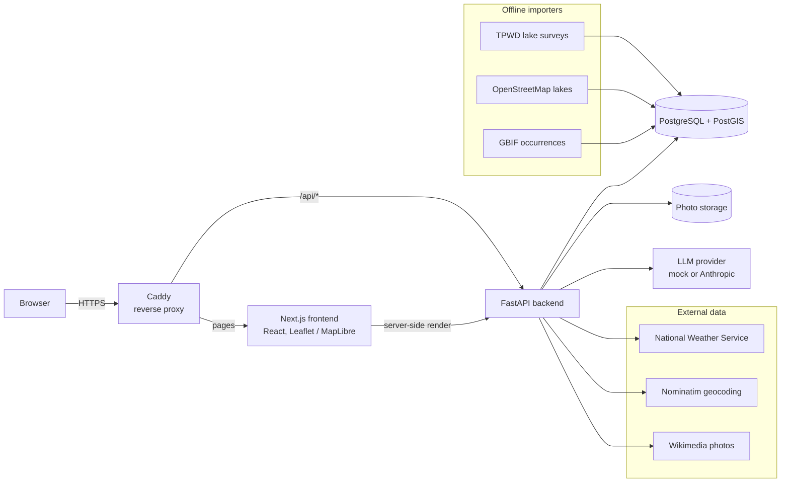

# FishEye

[](https://github.com/pwzerus/FishEye/actions/workflows/ci.yml)

**Find fishable water near you, wherever you are, and know what to do when you get there.**

FishEye is a map-first fishing assistant for beginners. Open the map (or search
a city, lake or ZIP code) and it shows the lakes around you. Pick one and it
tells you what lives there, whether you can get to the water legally, what the
weather means for fishing today, and how to catch the fish you're after, with
every claim traced back to an official source.

It is a portfolio project, built end to end by one engineer: data pipelines,
API, scoring engine, grounded LLM features with evals, web app, Docker and CI.

## The problem

Someone new to fishing, or someone who just moved or is travelling, asks the
same three questions: *where is the water near me, can I fish there, and how?*
Today the answers are spread over a state agency's survey reports, a separate
stocking site, a weather forecast, OpenStreetMap, forum posts and YouTube.
None of them answers "near me", and most assume you already know the jargon.

FishEye pulls those sources into one place, organised around **where you are**:

1. **Find water nearby.** Your location (or a search) centres the map; nearby
   lakes load for whatever is in view. Every named lake in Texas can be loaded
   from OpenStreetMap, with a curated set of verified lakes on top.
2. **Know what you'll find.** Species are split into evidence tiers and labelled
   as such: *confirmed* by an official survey (Texas Parks & Wildlife), or
   *reported* from museum, agency and citizen-science records (GBIF).
3. **Know when and how.** A spot score and morning/evening bite windows from
   the National Weather Service forecast, reviewed guides for twelve species,
   and a Q&A over those guides that answers in plain language and cites them.

Coverage today is Texas; the data model and importers are per-state (see
[Roadmap](#roadmap)).

## What it does

| Page | |
|---|---|
| **Map** (`/map`) | Locate me / search; lakes in view, with verified lakes always kept and the rest ranked by size when a view is crowded; a lake panel with species, access points, weather, bite windows and an AI explanation of the ranking. |
| **Fish guides** (`/fish`) | Twelve species: how to recognise each one (look-alikes compared on the same features), where and when, bait, lures, beginner tackle setups. Every section cites its sources. |
| **Ask** (`/ask`) | Free-text questions ("how do I tell white bass from hybrid striped bass?") answered from the guides only, with citations; "not covered" when the guides don't say. |
| **Community** (`/community`) | Accounts and catch pins with photos, with moderation tools for admins. |

## Architecture



**Backend** (Python 3.11, FastAPI, SQLAlchemy 2, Alembic, Pydantic)

- `data_import/`: TPWD survey scraper (respects robots.txt), statewide OSM
  lake import, GBIF occurrence import, demo seed.
- `services/scoring.py`: the spot score. Each factor is a value *or* "no
  data", never a silent zero; missing factors are dropped and the rest
  renormalised, and the result carries a confidence.
- `services/weather_adapter.py`, `geocoding.py`, `species_photos.py`: every
  external API sits behind an adapter with a timeout, one retry, a circuit
  breaker and caching, so a slow upstream degrades one panel, not the page.
- `services/ai_advisor.py`, `services/rag/`: the LLM features (below).
- `db/spatial.py`: radius and viewport queries. PostGIS `ST_DWithin` on
  PostgreSQL; the same API on SQLite for zero-setup development.

**Frontend** (Next.js 16, React 19, TypeScript): server-rendered pages,
Leaflet and MapLibre maps, a US states layer, Vitest + Testing Library.

**Infrastructure**: Docker Compose runs the whole stack with one command;
a production layer adds Caddy (automatic HTTPS) for a single server.
GitHub Actions runs lint and tests (backend on SQLite *and* PostGIS),
a production frontend build, and a Docker build with smoke tests on every push.

## Engineering highlights

- **LLMs on a leash.** The model only writes prose. Citations, links and
  facts come from the server, and every reply is validated before anyone
  sees it: it must cite passages it was actually given, may not contain a
  URL, may not name a fish its sources don't mention, and may not contain a
  number (hook size, line weight) that isn't in its sources. Failures retry
  once, then fall back to quoting the guide verbatim, labelled as such.
- **Retrieval measured, not assumed.** Guide Q&A uses BM25 with species
  routing rather than embeddings, chosen on an eval set of 36 beginner-phrased
  questions (hit@4 97%, off-topic and not-covered questions refused 100%).
  The eval runs in the test suite, so a regression fails CI.
- **Honest data.** Confirmed, reported and map-only lakes are separate tiers,
  enforced in the scoring engine and the AI checks, not just in the UI.
  Access points are hand-verified rather than geocoded from driving
  directions, because a wrong pin labelled "public access" sends someone
  onto private land.
- **Runs without keys.** A mock LLM provider with injectable failures,
  keyless weather (NWS) and OpenStreetMap tiles mean a clean clone works
  with `docker compose up`, and the failure paths are tested, not just the
  happy path.
- **Decisions written down.** 20 architecture decision records in
  [`docs/adr/`](docs/adr/), each with the alternatives considered and the
  trade-off taken.

## Run it

Needs Docker (Docker Desktop on Windows or macOS). No API keys.

```bash
docker compose up --build
```

- Web app: http://localhost:3000
- API docs: http://localhost:8000/docs

This starts PostgreSQL with PostGIS, the API and the web app, and seeds three
demo lakes. Data is kept in Docker volumes between runs; `docker compose down
-v` wipes it and the next start re-seeds.

Optional settings (map tiles, a real LLM, Google sign-in) go in a `.env` file
next to `docker-compose.yml`: `cp .env.example .env` and fill in what you
have.

To load every named lake in Texas from OpenStreetMap (a few minutes, needs
network):

```bash
docker compose exec backend python -m app.data_import.osm_waterbody_import --state TX
```

Running without Docker: [`backend/README.md`](backend/README.md) and
[`frontend/README.md`](frontend/README.md). Putting it on a server:
[`docs/deploy-aws.md`](docs/deploy-aws.md).

## Repository layout

```
backend/    FastAPI app, importers, scoring, LLM + RAG, tests and evals
frontend/   Next.js app
docs/       product spec (PRD.md), ADRs, deployment, scoring rationale
docker-compose.yml        local stack
docker-compose.prod.yml   single-server production layer (with Caddyfile)
.github/workflows/ci.yml  CI
```

## Roadmap

**Next: public demo**
- Rate limiting on anonymous endpoints (Q&A, geocoding, advisor).
- Deploy on AWS: one EC2 server with Docker and Caddy, a domain and HTTPS.
- Then managed services: RDS PostgreSQL + PostGIS, photos on S3, images in
  ECR, secrets in SSM Parameter Store, logs and alarms in CloudWatch.

**AI**
- Turn on a real model behind a per-day spend cap, judged by the same eval
  set as the mock.
- Hybrid retrieval (BM25 + embeddings with reciprocal-rank fusion) once the
  eval shows paraphrase misses worth fixing.

**Coverage**
- Beyond Texas: the OSM and GBIF importers already take a state; each new
  state needs its agency's survey data and regulations.
- More species guides, and identification sections for the remaining ones.
- Mobile-friendly map and offline-tolerant lake pages for use at the water.

## Status

Active development. Built by [Yifei Wang](https://github.com/pwzerus).
